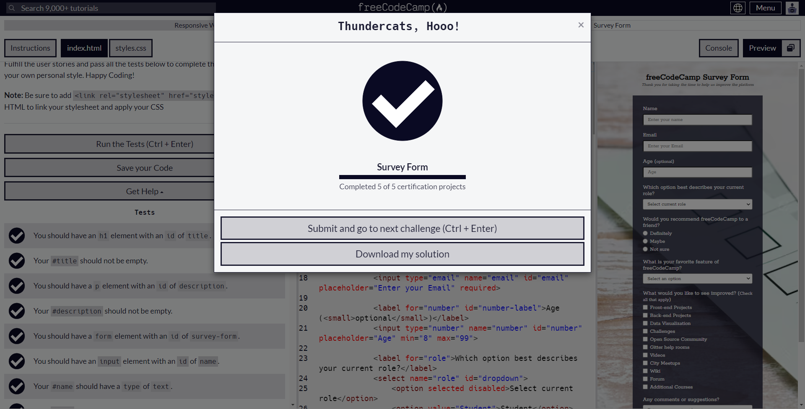
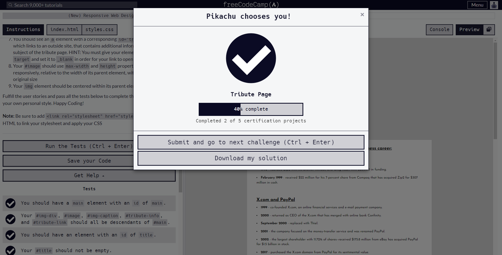
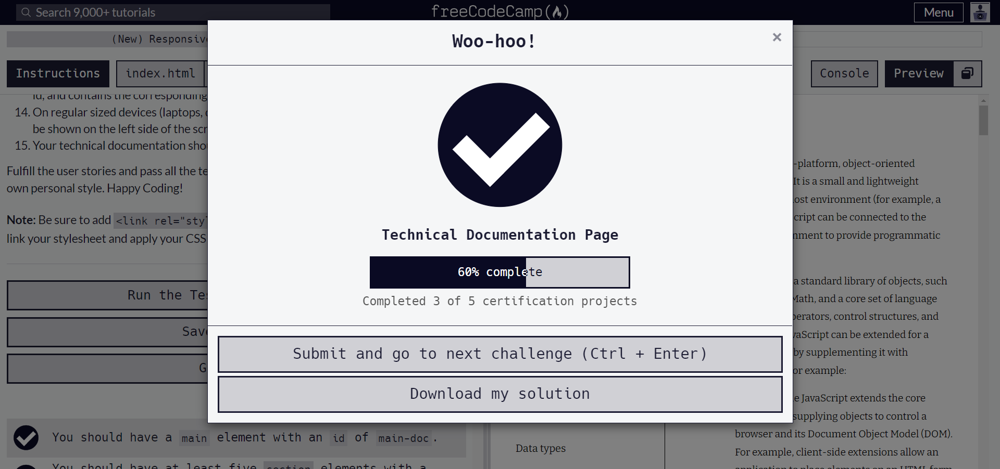
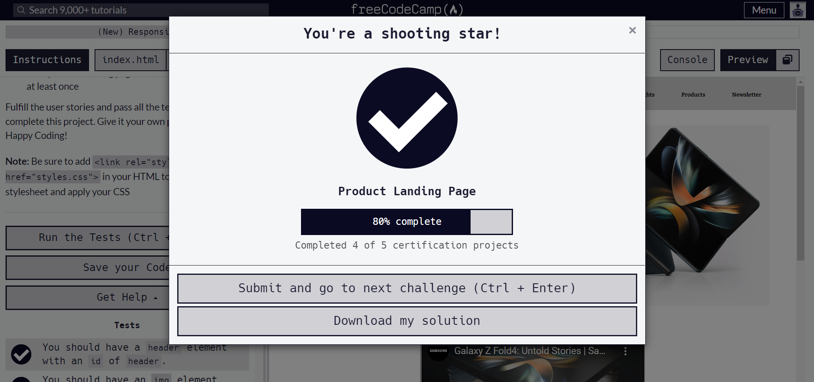
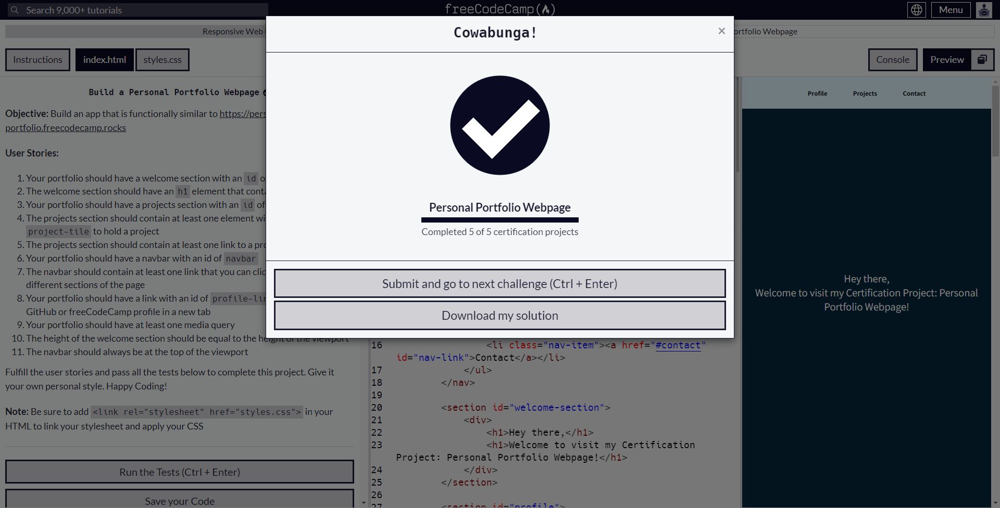

# freeCodeCamp

## Table of Content
- [Responsive Web Design](#responsive-web-design)
    - [Survey Form](responsive%20web%20design/survey%20form)
    - [Tribute Page](responsive%20web%20design/tribute%20page)
    - [Technical Documentation Page](responsive%20web%20design/technical%20documentation%20page)
    - [Product Landing Page](https://github.com/dwz-wong/100daysofcode/tree/main/day18-19/product%20landing%20page)
    - [Personal Portfolio Webpage](https://github.com/dwz-wong/100daysofcode/tree/main/day44-46/personal%20portfolio%20webpage)

## Responsive Web Design

### Survey Form

[Solution](responsive%20web%20design/survey%20form) | [Live Site](https://dwz-wong-survey-form.netlify.app/)

### Tribute Page

[Solution](responsive%20web%20design/tribute%20page) | [Live Site](https://dwz-wong-tribute-page.netlify.app/)

### Technical Documentation Page

[Solution](responsive%20web%20design/technical%20documentation%20page) | [Live Site](https://dwz-wong-technical-documentation-page.netlify.app/)

### Product Landing Page

[Solution](https://github.com/dwz-wong/100daysofcode/tree/main/day18-19/product%20landing%20page) | [Live Site](https://day18-19-of-100days-challenge.netlify.app/)

### Personal Portfolio Webpage

[Solution](https://github.com/dwz-wong/100daysofcode/tree/main/day44-46/personal%20portfolio%20webpage) | [Live Site](https://day44-46-of-100days-challenge.netlify.app/)
